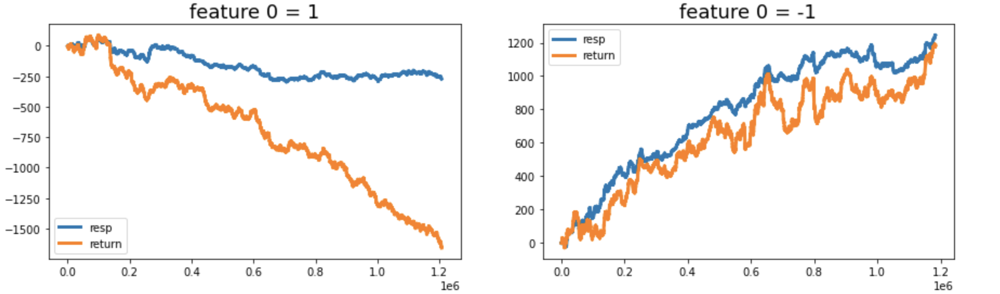

# Data Processing and Feature Engineering

## 认识数据

Jane Street Market Prediction，本次比赛的数据集包含四个文件，分别是`train.csv`，`features.csv`，`example_test.csv`和`example_sample_submission.csv`。

### train.csv

**feature_{0...129}(column)**：real stock market data；

**trading opportunity(row)**：a trading opportunity, for which you will be predicting an action value: 1 to make the trade and 0 to pass on it；

**weight and resp**：a return on the trade；Trades with weight = 0 were intentionally included in the dataset for completeness, although such trades will not contribute towards the scoring evaluation.

**resp_{1,2,3,4}**：returns over different time horizons；

**date**：an integer which represents the day of the trade；

**ts_id**：a time ordering.


#### resp


在`train.csv`文件中，提供`features_{1...4}`，但是在Prediction中，只提供了`resp`用于计算最终的收益。所以不同时间范围是表示什么意思呢？不同策略 or for more rubost policy?

猜测`weight`可能和上一次是否交易有关，但经过数据拟合验证无直接联系。

#### feature_0



`feature_0`取值为1和-1，两者的数量大体相当，并且可区分两种resp上升与下降分布，所以feature_0代表bid/ask, long/short, or call/put？不懂，无法使用`feature_0`。

其他特征见EDA-notebook

### 总结

- 目标值：`resp_{1...4}`表示不同时间范围内的收益，与`resp`保持大体相同的增长趋势，并且`resp`与`resp_{4, 1, 2}`相关度高。另外在计算每一次trade时，使用`weight * resp`更准确。当`resp > 0`时，`action = 1`，否则为0，或者取`resp_{1...4}`和`resp`的中位数作为`action`的取值。
- 特征值：经过可视化，发现`feature_{1...129}`中存在四种数据类型：分别是线性正相关(Linear)，线性负相关(Negative)，复杂的(Noisy)，和混合的(Hybryd)，相关性不明显。
- 缺失值：10%的数据缺失值占比大于10%，猜测可能与交易的时间的间隔相关。

## 数据处理

 `train.csv`是主要的训练数据，大小约为`5G`。kaggle的线上硬件是动态变化的，标准提供`13G`内存，当数据过大，一方面花费过长时间读取数据，另一方面大体积大数据在粗心操作后容易爆内存使得程序运行变得缓慢。因此，需要在数据读取和检索速度和减小数据占用内存两方面分析。

### 读取速度

这里比较不同库读取文件的数据：

| Method             | Wall Time         | Note                       |
| ------------------ | ----------------- | -------------------------- |
| Pandas             | 1min 34s ± 5.85 s | 默认                       |
| Datatable          | 16.8 s ± 543 ms   | 需to_pandas                |
| Rapids－Cudf       | 7.43 s ± 41.8 ms  | 需要GPU，国内无法下载      |
| Pickle + Datatable | 6.62 s ± 1.35 s   | 先datatable，后pickle.load |
| Joblib + Datatable | 6.54 s ± 6.84 s   | 先datatable，后joblib.load |
| Feather + Pandas   | 3.07 s ± 1.41 s   | 先pandas，后read_feather   |
| Parquet + Pandas   | 8.09 s ± 2.66 s   | 先pandas，后read_parquet   |
| Jay + Datatable    | 204 µs ± 12.2 µs  | 先datatable，后to_jay      |
| hdf5 + Pandas      | 8.11 s ± 1.1 s    | 先pandas，后read_hdf       |

- Jay + Datatable是最快的，但需要Datatable先读取，其他的Two stages也是这样的情况。
- 优先选择Datatable，在需要GPU的程序中使用Cudf，两者相差不大。
- 可在明确数据集不变的情况下，提前处理并上传预读取的数据集，在Second Stage中使用对应的方法读取。

### 检索速度

为方便检索样本，将读取数据转换为Pandas格式。训练数据：`(2390491, 138)`，测试数据超15000行。

#### 单个元素检索

| ID   | Method                          | Wall Time         |
| ---- | ------------------------------- | ----------------- |
| 1    | test_df['weight'].item() > 0    | 8.11 µs ± 44.3 ns |
| 2    | test_df['weight'].values[0] > 0 | 5 µs ± 18.9 ns    |

方法二比方法一块`38%`。

#### 单列元素检索

```
test_df_columns = ['weight'] + [f'feature_{i}' for i in range(130)] + ['date']
features = [c for c in train.columns if 'feature' in c]
```

| ID   | Method                                           | Wall Time        |
| ---- | ------------------------------------------------ | ---------------- |
| 1    | test_df.loc[:, features].values                  | 675 µs ± 20.9 µs |
| 2    | test_df.values[0\][index_features].reshape(1,-1) | 36.8 µs ± 179 ns |

方法二比方法一块`94%`。

#### 概率变换

最终推理过程需将概率变为`Int`。

| ID   | Method                                 | Wall Time         |
| ---- | -------------------------------------- | ----------------- |
| 1    | np.where(pred >= th, 1, 0).astype(int) | 5.5 µs ± 100 ns   |
| 2    | (pred >= th).astype(int)               | 2.36 µs ± 9.99 ns |
| 3    | int(pred >= th)                        | 1.63 µs ± 7.56 ns |

方法三比方法一快`70%`。

#### 结果填入

| ID   | Method                          | Wall Time        |
| ---- | ------------------------------- | ---------------- |
| 1    | pred_df.action = 0              | 113 µs ± 1.38 µs |
| 2    | pred_df["action"] = 0           | 65.2 µs ± 365 ns |
| 3    | pred_df["action"].values[0] = 0 | 4.13 µs ± 113 ns |

方法三比方法一快`96%`。

## 内存占用

大数据量，根据整数类型，浮点类型的范围减少位数。具体是针对每一列，读取每一列的数据的极值，从低位的`int`和`float`选取，降低内存消耗。并且及时删除冗余对象，进行垃圾回收，**减少RAM过载**。

```python
if c_min > np.iinfo(np.int8).min and c_max < np.iinfo(np.int8).max:
  df[col] = df[col].astype(np.int8)
```

| ID   | Method                       | Memory     |
| ---- | ---------------------------- | ---------- |
| 1    | dataframe                    | 2516.84 MB |
| 2    | dataframe + reduce_mem_usage | 631.49 MB  |

方法二比方法一节省约`75%`的Memory，消耗时间可以忽略不计。

### 缺失值nan处理

对于数值型缺失值，用平均值填补。

在开始的dataframe数据类型阶段使用dataframe的自带fillna的方法填充而不是numpy，因为要保持数据的可操作性，并保存均值为numpy格式。

在推理阶段，数据是一行一行输入的，即按照时间先后次序输入序列数据，此时，读取numpy格式的均值，并且使用numba库加速计算，将其编译成机器码运行。numba适合使用numpy数组做大量科学计算以及使用for循环情况。

```python
@njit
def fillna_npwhere_njit(array, values):
    if np.isnan(array.sum()):
        array = np.where(np.isnan(array), values, array)
    return array
```

| ID   | Method              | Wall Time        |
| ---- | ------------------- | ---------------- |
| 1    | Pandas.fillna()     | 11.6 s ± 66.1 ms |
| 2    | fillna_npwhere_njit | 30.2 ms ± 151 µs |

方法二比方法一快一个量级。

## 特征工程

- 去除前85天的数据，因为EDA中前85天交易数据很频繁，与后续数据差异较大。
- 去除`weight`为0的数据，因为`weight=0`表示没有意义的交易，在此交易下的`resp`和`action`无参考价值。
- 用所有resp来训练模型，将`resp_{1...4}`和`resp`一起作为feature，Prediction阶段可选单`resp`或者所有的中位数作为`action`取值。

```python
features = [f'feature_{i}' for i in range(130)]
resp_cols = ['resp_1', 'resp_2', 'resp_3', 'resp', 'resp_4']
```

- StandardScaler和PCA（可选），用130个特征做的PCA。仅仅16维的空间就可以解释80%的信息了。所以130个特征的还是非常冗余的。


- 构建`cross_41_42_43`和`cross_1_2`两个特征（可选）,利用LightGBM训练得到的特征重要性如下。

```python
train['cross_41_42_43'] = train['feature_41'] + train['feature_42'] + train['feature_43']
train['cross_1_2'] = train['feature_1'] / (train['feature_2'] + 1e-5)
```


## Reference

[Reference1](https://www.kaggle.com/tocha4/20210204-speed-up-your-prediction)

[Reference2](https://www.kaggle.com/abdolazimrezaei/decrease-dataframe-size-75-and-speed-up-modelling)

[处理大规模数据集](https://mp.weixin.qq.com/s/SmQ5okytre7auGTgLVlY8w)

[特征工程](https://zhuanlan.zhihu.com/p/48927063)

[博客](https://zhuanlan.zhihu.com/p/340535782)

[博客2](https://zhuanlan.zhihu.com/p/349246542)

[经验1](https://zhuanlan.zhihu.com/p/49094829)

[调参1](https://zhuanlan.zhihu.com/p/33096877)

